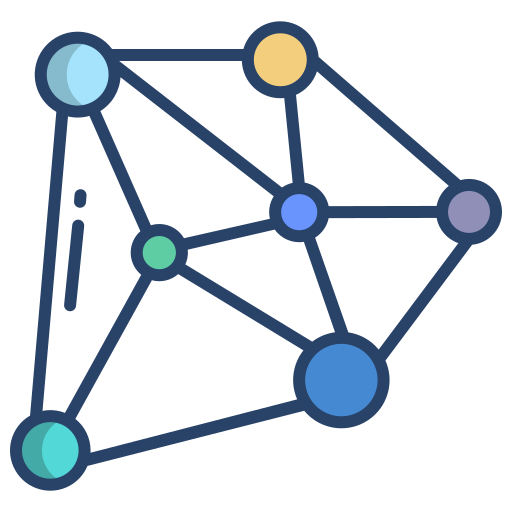

# 4. Algorithms on graphs

## Week 1: Graph decomposition - 1

1. Finding exit from maze ❌
2. Adding exits to maze ❌

## Week 2: Graph decomposition - 2

1. CS curriculum ❌
2. Order of courses ❌
3. Intersection reachability ❌

## Week 3: Paths in graphs - 1

1. Flight segments ❌
2. Bipartite ❌

## Week 4: Paths in graphs - 2

1. Minimum flight cost ❌
2. Detecting anomalies ❌
3. Exchanging money ❌

## Week 5: Spanning trees

1. Connecting points ❌
2. Clustering ❌
