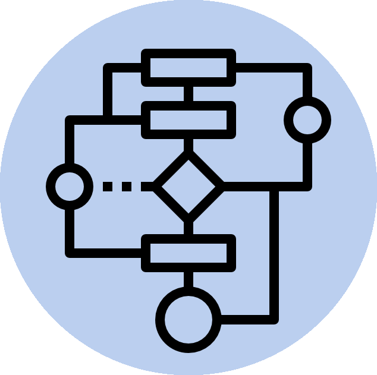

# Algorithms and data structures

This repo is used as a notebook where I will save some information/code that I will find/develop during completion of 6 courses on data structures and algorithms from coursera.

Every part of the course has it's own `README.md` where you can find problem names and sometimes different links with materials.

1. [Algorithmic toolbox](1-algorithmic-toolbox/README.md)
2. [Data structures](2-data-structures/README.md)
3. [Algorituhms on strings](3-algorithms-on-strings/README.md)
4. [Algorithms on graphs](4-algorithms-on-graphs/README.md)
5. [Advanced algorithms and complexity](5-advanced-algorithms-and-complexity/README.md)

## Links

1. Great alternative solutions: [Coursera DS and algos](https://github.com/virtyaluk/coursera-data-structures-algorithms)
2. Great alternative solutions (python only): [Coursera DS and algos](https://github.com/Sonia-96/Coursera-Data_Structures_and_Algorithms)